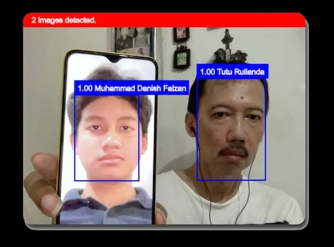

# CodeBox
[CodeBox](https://codebox.tuturulianda.com) is a face biometrics suite web app based on JavaScript, and Exadel Compreface is the backend. A brief explanation of this project is stated as follows. Credit goes to Vincent Mühler for his brilliant face-api js.

# Real-Time Face Recognition and Detection Suite
Citation: OpenAI. (2024). ChatGPT (3.5) [Large language model]. https://chat.openai.com

The human face has always had a fascinating attractiveness due to its complex tapestry of features. These days, face detection and recognition suites—powerful tools—are being created by technology by using this curiosity. These suites are transforming many industries, including border security and smartphone unlocking, but their ethical ramifications need to be carefully considered.

# The Anatomy of the Suite
Similar to a digital detective, a face detection and recognition suite functions. Initially, it uses algorithms to find faces in pictures or movies. This first stage is based on recognizing certain facial landmarks, such as the mouth, nose, and eyes. The suite recognizes faces by comparing their extracted traits to a database of people who are known to exist. The system identifies the person if a match is discovered. Another level of complexity is added by advanced suites' ability to identify emotions or demographics.

# Numerous Applications
There are many different and quickly growing applications for this technology. Facial recognition is useful in security and surveillance because it makes it easier to identify offenders, manage access, and keep an eye on public areas. Additionally, it enables tailored experiences, as demonstrated by targeted advertising or social network photo tagging. It also encourages the use of facial movements for navigating interfaces and unlocking devices as accessibility solutions.

# Ethical Inspection
But there are moral questions around the use of facial recognition technology. Algorithmic biases may result in erroneous identifications, which disproportionately affect marginalized communities. Privacy concerns are raised by the possibility of widespread surveillance, and improper use of this technology may violate people's rights.

# Progressing Sustainably
Responsible development and implementation are essential as we negotiate the challenging field of face detection and identification. To reduce the hazards, it is imperative to have clear legislation, strong data protection protocols, and transparent algorithms. Talking openly about how technology affects society is just as vital.

# Conclusion
Face detection and identification technology has a bright future, but there are obstacles to overcome. Through responsible and ethical utilization of its power, we can guarantee that this technology is in the best interests of humanity.
